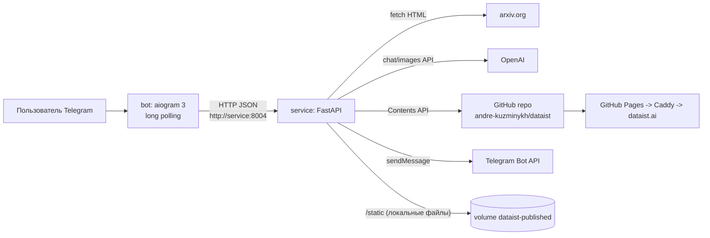

# Спецификация системы «Dataist arXiv Pipeline»

Актуальна на 2026-08-05. Описывает систему **как она реализована** в этом репозитории; требования-первоисточник — `prd.json` (расхождения кода с PRD перечислены в `AUDIT.md`).

---

## 1. Назначение

По ссылке на статью arXiv система автоматически производит готовый контент-пакет:

1. распарсенная статья (абстракт, полный текст, иллюстрации с подписями);
2. редакционный обзор на русском в стиле Dataist (LLM), с расставленными по смыслу иллюстрациями;
3. английский перевод обзора;
4. обложка, сгенерированная по референсному изображению бренда;
5. брендированная HTML-страница (RU/EN) по Jinja2-шаблону;
6. публикация в GitHub-репозиторий (GitHub Pages, домен `https://dataist.ai/YYYY-MM-DD/`);
7. анонс-тизер в Telegram с переключателем RU/EN и кнопкой удаления.

Управление — через Telegram-бота с интерактивными шагами (выбор заголовка, правка описания обложки, утверждение изображения).

## 2. Архитектура

Два контейнера в одной docker-сети (`docker-compose.yml`):



- **`bot/`** — тонкий клиент: FSM-диалог, вызовы HTTP API сервиса, ни одного обращения к OpenAI/GitHub напрямую.
- **`service/`** — вся бизнес-логика в сервисных классах; API-слой FastAPI поверх них.

### 2.1. Сервисные классы (`service/service/pipeline/`)

| Класс | Ответственность | Ключевые методы |
|---|---|---|
| `URLResolverService` | Валидация arXiv-URL, приведение `/abs/` → `/html/...vN` (v1 по умолчанию); домены `arxiv.org`, `www.`, `ar5iv.labs.arxiv.org`; `/pdf/` и старые ID (`cs/XXXXXXX`) не принимаются | `validate_url`, `resolve_html_url`, `resolve` |
| `ArxivParserService` | Загрузка HTML (httpx, timeout 30 c, свой User-Agent) и парсинг (BeautifulSoup+lxml): абстракт (3 стратегии — `blockquote.abstract`, `div.ltx_abstract`, `<section>` c заголовком Abstract), полный текст (`<article>` → `div.ltx_page_content` → `<body>`), фигуры из `<figure>` (url, filename, caption, figure_id, figure_label). Относительные URL картинок резолвятся с сохранением paper ID (BR020), уже абсолютные — не трогаются | `fetch_html`, `parse_article`, `_extract_figures`, `_resolve_image_url`, `parse` |
| `ContentGeneratorService` | Все LLM-вызовы (OpenAI chat.completions, модель из `OPENAI_MODEL`): обзор, пост-процессинг англицизмов (BR025), заголовок/подзаголовок, 10 вариантов заголовков и регенерация по пользовательскому (BR013/BR014), описание обложки и его правка, тизер (BR026), перевод, извлечение ссылок (JSON) | `generate_editorial`, `postprocess_editorial`, `generate_titles`, `regenerate_titles`, `generate_cover_description`, `edit_cover_description`, `generate_teaser`, `translate_article`, `extract_links` |
| `VisualGeneratorService` | Обложка через `images.edit` с референсным изображением из стиль-профиля (BR012/BR016), размер 1536×1024; редактирование существующей обложки (передача предыдущей картинки); при ошибке возвращает `None` (BR009); сохранение в `ASSET_STORAGE_PATH/<slug>/cover.png` | `generate_cover_prompt`, `generate_cover_image`, `save_cover_locally`, `generate_and_save` |
| `HtmlBuilderService` | Сборка страницы из Jinja2-шаблона (`config/templates/<id>.html`, autoescape): преобразование markdown-подобного текста (`##`-секции, `**bold**`, списки-карточки, метрики `A → B`) в HTML; маркеры `[FIGURE:N]`/`[CAPTION:...]` от LLM; авторазмещение фигур, если LLM их не расставил; OG-метаданные; slug через `python-slugify` (max 80) | `build_html_page`, `_build_article_html_from_sections`, `_build_og_meta`, `_generate_slug` |
| `PublisherService` | Локальная идемпотентная публикация HTML/бинарников в `ASSET_STORAGE_PATH/<slug>/`, раздаётся FastAPI-примонтированным `/static` | `publish_html`, `publish_asset` |
| `GitHubPublisherService` | Публикация через GitHub Contents API в ветку `main` репо `GITHUB_REPO`: папка `YYYY-MM-DD` (UTC), при занятости — суффиксы `_1`, `_2`, … (BR017/BR018); удаление папки целиком (BR021). Без токена — no-op | `publish`, `delete_folder`, `_put_file`, `_find_available_folder` |
| `TelegramDeliveryService` | Отправка сообщений через Bot API (HTML parse mode); форматирование пары (RU, EN)-текстов: `<b>title</b>` + тизер + ссылки «Читать статью»/«Read the article» + невидимый символ-ссылка на обложку для превью | `send_message`, `_format_telegram_message` |
| `PipelineOrchestratorService` | Одношаговый прогон всего пайплайна (эндпоинт `/process`; интерактивный флоу бота им **не** пользуется). Стейт-машина шагов с диагностикой | `run` |

### 2.2. Схемы данных (`service/schema/pipeline/article_schema.py`)

Pydantic-модели запросов/ответов API: `ParseRequest/Response`, `TitlesRequest/Response`, `TitlesRegenerateRequest`, `EditorialRequest/Response`, `CoverDescriptionRequest/Response`, `CoverEditRequest`, `CoverGenerateRequest/Response`, `BuildPublishRequest/Response`, `PipelineRequest/Response` + доменные `ParsedArticleSchema`, `FigureSchema`, `EditorialArticleSchema` и др. Внутри сервисного слоя данные передаются dict'ами.

## 3. HTTP API сервиса

Базовый префикс: `/api/v1/pipeline`. Аутентификации нет (см. AUDIT C1). Ошибки: `AppException` → 422 `{status, error:{code, message, stage, retriable}}`; прочие → 500; шаговые эндпоинты дополнительно кидают `HTTPException` 422/502/500.

| Метод и путь | Назначение | Вход (основное) | Выход (основное) |
|---|---|---|---|
| `POST /process` | Весь пайплайн одним вызовом (легаси-путь) | `source_url`, `target_languages=["ru","en"]`, профили | `status`, `source`, `assets`, `pages`, `messages`, `diagnostics{warnings, steps}` |
| `POST /parse` | Шаг 1. Валидация URL + парсинг статьи | `source_url` | `status`, `source{arxiv_abs_url, arxiv_html_url}`, `parsed_article{abstract, article, figures[]}`, `short_intro` |
| `POST /generate-titles` | Шаг 2. 10 вариантов заголовков | `short_intro`, `abstract` | `titles[]` |
| `POST /regenerate-titles` | Шаг 3. 10 новых по мотивам пользовательского | `custom_title`, `short_intro`, `abstract` | `titles[]` |
| `POST /generate-editorial` | Шаг 4. Полный обзор с выбранным заголовком; заголовок делится на main/sub по `:` / `—` / `-` | `parsed_article`, `chosen_title` | `title`, `subtitle`, `short_intro`, `article_body`, `links` |
| `POST /generate-cover-description` | Шаг 5. Текстовое описание обложки | `article_summary` | `description` |
| `POST /edit-cover-description` | Шаг 6. LLM-правка описания по фидбеку | `current_description`, `user_feedback` | `description` |
| `POST /generate-cover` | Шаг 7. Генерация картинки (по референсу стиля или по предыдущей обложке), сохранение локально | `description`, `slug`, `previous_cover_url?` | `cover_url` (относительный), `public_url` |
| `POST /build-and-publish` | Шаг 8. Тизеры RU/EN → RU HTML локально → **GitHub-публикация RU** (папка `YYYY-MM-DD[_N]`: `cover.png`, `fig_i.*`, `index.html`; ссылки на фигуры в HTML заменяются на локальные) → EN перевод + EN HTML локально → тексты Telegram-сообщений → отправка в `TELEGRAM_CHAT_ID`, если задан | `title`, `subtitle`, `article_body`, `short_intro`, `cover_image_url`, `links`, `figures[]`, `source_url`, `target_languages` | `status` (`success` / `completed_with_warnings`), `pages{ru_html_url, en_html_url, cover_url}`, `messages{ru_telegram_text, en_telegram_text}`, `diagnostics` |
| `POST /delete-article` | Удаление папки статьи из GitHub | `{folder: "YYYY-MM-DD[_N]"}` | `{ok: bool}` |
| `GET /static/...` | Локально опубликованные файлы | — | файлы из `ASSET_STORAGE_PATH` |

Тайм-ауты клиента в боте: parse/titles/description — 60 с, editorial — 300 с, cover — 120 с, build-and-publish — 600 с.

## 4. Telegram-бот

### 4.1. Вход в сценарий

- `/start`, `/help` — справка (RU/EN по `language_code` пользователя);
- `/review` — просьба прислать ссылку (или `/review <url>` сразу);
- **любое сообщение с `arxiv.org`-ссылкой** запускает пайплайн без команды (SC014).

### 4.2. FSM (`bot/state/review_state.py`) и флоу

```
waiting_for_url → parsing → choosing_title → [typing_custom_title]
→ viewing_cover_description → [typing_cover_edit] → generating_image
→ reviewing_image → building → (state.clear)
```

1. **Парсинг**: `⏳ Парсю статью...` → `/parse` + `/generate-titles`.
2. **Выбор заголовка** (SC011/BR013/BR014): сообщение со списком 1–10 и кнопками `[1..10]`, `✏️ Ввести своё`, `🔄 Новые`. Кнопка-цифра — выбор; произвольный текст — регенерация 10 вариантов по мотивам текста (BR014); «Ввести своё» → введённый текст становится заголовком напрямую (SC011).
3. **Описание обложки** (SC012/BR015): показывается сгенерированное описание, кнопки `✏️ Ввести своё` (замена целиком), `🔄 Новое` (регенерация), `🖼 Сгенерировать`. Произвольный текст — LLM-правка текущего описания.
4. **Ревью изображения**: обложка приходит фотографией; произвольный текст — правка описания + перегенерация (предыдущая обложка передаётся как база для `images.edit`); `✅ Утвердить` — дальше.
5. **Сборка и публикация** (SC013/SC015): `/generate-editorial` → `/build-and-publish`. Финальное сообщение: `<b>заголовок</b>` + тизер (3 абзаца) + `📜 Полный обзор` (гиперссылка), кнопки `🇬🇧 English`/`🇷🇺 Русский` (переключение текста сообщения) и `🗑 Удалить`.
6. **Удаление** (SC018/BR021): `🗑 Удалить` → подтверждение `❌ Нет / ✅ Да, удалить` → `/delete-article` → сообщение заменяется подтверждением.

Все промежуточные сообщения бот удаляет (идентификаторы копятся в FSM-данных `_m`); финальные RU/EN-тексты кешируются в памяти процесса (`_final_cache`) для переключателя языков.

### 4.3. Слой `bot/node/` (легаси)

Архитектура «trigger → code → answer» от первой версии: используется только `ReviewTrigger` (извлечение arXiv-URL регэкспом). `ReviewCode` (вызов `/process`) и `Review*Answer` — мёртвый код (см. AUDIT M2).

## 5. Конфигурация

### 5.1. Переменные окружения — service (`service/core/config.py`)

| Переменная | Default | Смысл |
|---|---|---|
| `OPENAI_API_KEY` | `""` | Ключ OpenAI (обязателен фактически) |
| `OPENAI_MODEL` | `gpt-5.4` | Модель текстовой генерации |
| `OPENAI_IMAGE_MODEL` | `gpt-image-1.5` | Модель генерации изображений |
| `TELEGRAM_BOT_TOKEN` | `""` | Токен для отправки готовых постов |
| `TELEGRAM_CHAT_ID` | `""` | Канал/чат автопостинга (пусто — не отправлять) |
| `ASSET_STORAGE_TYPE` | `local` | Тип хранилища (реализован только local) |
| `ASSET_STORAGE_PATH` | `./published` | Каталог локальной публикации (volume) |
| `ASSET_PUBLIC_BASE_URL` | `http://localhost:8000/static` | База публичных URL локальной публикации |
| `PROMPT_PROFILE_ID` | `default_ai_editorial_v1` | Профиль промптов |
| `STYLE_PROFILE_ID` | `cinematic_orange_violet_v1` | Стиль-профиль обложки |
| `HTML_TEMPLATE_PROFILE_ID` | `dataist_article_v1` | HTML-шаблон |
| `REFERENCE_IMAGE_URL` | `""` | (Зарезервировано; референс берётся из стиль-профиля) |
| `GITHUB_TOKEN` | `""` | PAT для публикации (пусто — GitHub-шаг пропускается/падает с warning) |
| `GITHUB_REPO` | `andre-kuzminykh/dataist` | Репозиторий публикации |
| `GITHUB_PAGES_URL` | `https://dataist.ai` | База публичных URL статей |
| `HOST`/`PORT`/`LOG_LEVEL` | `0.0.0.0`/`8000`/`INFO` | Сервер (в Docker — порт 8004) |

### 5.2. Переменные окружения — bot (`bot/core/config.py`)

| Переменная | Default | Смысл |
|---|---|---|
| `BOT_TOKEN` | — (обязательна) | Токен Telegram-бота |
| `BACKEND_URL` | `http://localhost:8000` | Адрес сервиса (в Docker — `http://service:8004`) |
| `ADMIN_CHAT_IDS` | `""` | CSV chat-id админов (объявлена, пока не применяется — AUDIT C2) |

### 5.3. Профили (`service/config/`, F003)

- **`prompts/<id>.json`** — `{id, version, prompts{editorial, editorial_postprocess, title, subtitle, titles_generation, titles_regeneration, cover_description, cover_description_edit, cover, teaser, translation, link_extraction, html_render}, glossary{}}`. Подстановка переменных — `str.format`; доступ — `ConfigLoader.get_prompt(profile, name, **vars)`.
- **`styles/<id>.json`** — палитра, настроение, `reference_image_url` (эталон обложки), negative prompt, аспект.
- **`templates/<id>.html`** — Jinja2-шаблон страницы: тёмная/светлая тема, Tailwind (CDN), OG/Twitter-мета, hero-обложка, секции статьи (`{{ article_html | safe }}`), CTA-кнопки arXiv/GitHub/HuggingFace.

`ConfigLoader` кеширует все профили в памяти процесса; замена файла требует рестарта (или нового profile_id).

## 6. Публикация и URL

- **Локально**: `ASSET_STORAGE_PATH/<slug>/{slug}_{ru|en}.html`, `cover.png` → `ASSET_PUBLIC_BASE_URL/<slug>/...` (FastAPI `/static`, volume `dataist-published`).
- **GitHub** (публичный путь, BR017–BR020, BR027): папка `YYYY-MM-DD` (UTC; занято → `_1`, `_2`, …) в ветке `main` репозитория `GITHUB_REPO`: `index.html` (RU), `cover.png`, `fig_0.png…` (фигуры скачиваются с arXiv и перекладываются рядом; ссылки в HTML заменяются на локальные). Публичный URL: `{GITHUB_PAGES_URL}/{folder}/`. Маршрутизацию `dataist.ai/2026-*` → GitHub Pages выполняет Caddy (вне этого репозитория).
- EN-страница на текущий момент публикуется только локально (расхождение с PRD — AUDIT H1).

## 7. Ошибки и статусы

Иерархия `service/core/exceptions.py`: `AppException(code, message, stage, retriable)` → `ValidationError` (URL_001/URL_002), `ParseError` (PARSE_001 HTTP-ошибка, PARSE_002 сеть), `GenerationError` (GEN_001), `PublishError`, `DeliveryError` (TG_HTTP_001, TG_API_<code>).

Статусы пайплайна: `success` → `completed_with_warnings` (любые warnings) → `validation_failed` / `html_fetch_failed` / `parse_partial` / `failed_publish` / `degraded_publish`. Каждый шаг пишется в `diagnostics.steps[{name, status: ok|partial|failed, error}]` (NFR009).

Принцип graceful degradation: отсутствие фигур, падение обложки, падение EN-перевода и падение Telegram-доставки не прерывают выпуск — фиксируются как warnings.

## 8. Деплой

- `docker-compose.yml`: сервисы `service` (порт 8004, volume `dataist-published`, `service/.env`) и `bot` (`bot/.env`, `depends_on: service`), сеть `dataist-net`.
- `deploy.sh`: деплой на GCE-хост `human-1` (europe-west1-b) по `gcloud compute ssh` — клонирует/обновляет репозиторий в `/opt/dataist_media`, генерирует оба `.env` из переменных окружения запускающего (`OPENAI_API_KEY`, `TG_BOT_TOKEN`), `docker compose up -d --build`, health-check `GET /docs`. Известные ограничения скрипта — AUDIT H2.
- Dockerfile'ы: `python:3.11-slim`; сервис дополнительно ставит gcc/libxml2 для lxml.

## 9. Тестирование

- Запуск: `pytest service/tests` (180) и `pytest bot/tests` (21); сеть и реальные ключи не нужны (bot-conftest сам подставляет фиктивный `BOT_TOKEN`; LLM/HTTP мокаются `unittest.mock` и `respx`).
- Структура зеркалирует PRD: `tests/F00X_<feature>/test_<SCnnn|BRnnn>_<name>.py`, в докстрингах Given/When/Then и трассировка к сценарию.
- Покрытие тест-кейсов PRD: T001–T016, BR017 (обе вариации), BR018, BR020, BR021, BR023, BR025, BR026 + сценарные SC001–SC011 — полностью; подробности и оставшиеся дыры — в `AUDIT.md §5`.

## 10. Карта фич PRD → код

| Фича | Основные модули | Тесты |
|---|---|---|
| F001 Ingestion & Parsing (BR001–BR005) | `url_resolver_service`, `arxiv_parser_service`, `/parse`; в боте `review_trigger` | `service/tests/F001_*`, `bot/tests/F001_*` |
| F002 Editorial & HTML (BR006–BR027) | `content_generator_service`, `visual_generator_service`, `html_builder_service`, `publisher_service`, `github_publisher_service`, `telegram_delivery_service`, `steps.py`, `review_widget.py` | `service/tests/F002_*`, `service/tests/F004_github_publishing` (выделенная группа для GitHub-правил BR017/BR018/BR021/BR023), `bot/tests/F002_*` |
| F003 Configuration (BR011–BR012) | `config_loader`, `service/config/*` | `service/tests/F003_*` |
